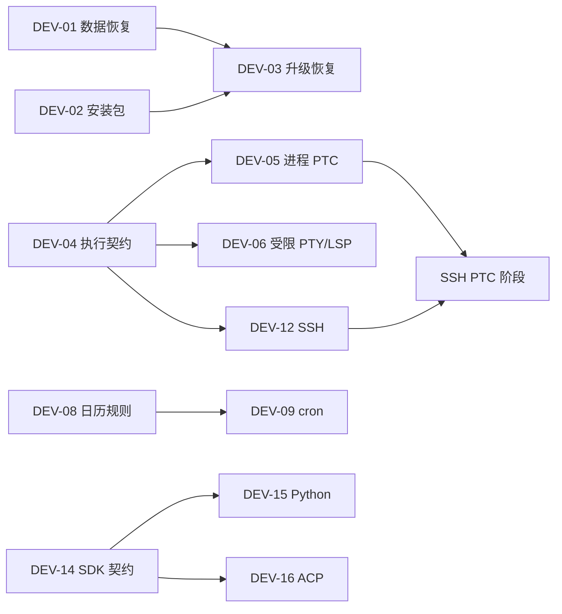

# YuanTu Agent 开发建议列表

日期：2026-10-05。

本建议基于 2026-10-05 的 DSH 能力对比与项目架构审阅整理，两份原始报告已删除。当前架构与能力说明见 [项目架构](../README.md#架构)和[工具目录](../README.md#工具目录)。P1 的 DEV-01～DEV-09 已逐项实施，接线、验证与剩余边界见 [P1 实施记录](p1-implementation-2026-10-05.md)。P2 的 DEV-13～DEV-18 首批实施见 [P2 实施记录](p2-implementation-2026-10-07.md)，DEV-18 早期拆分见 [契约拆分记录](contract-refactor-2026-10-05.md)。下列建议保留原范围与验收条件，不应整表作为尚未实现的待办；每批实施前应复核对应模块的最新代码。

建议先完成安装与恢复、统一执行环境、后台投递和调度，再拓展外部 Agent、远程工作区和 SDK。保留内建知识检索、任务验收、结构化文件效果与 Office 工具等现有能力。

## 1. 建议总表

优先级定义：**P1** 为优先建设的可靠性、交付与运行时能力；**P2** 为建立在现有基础上的生态和产品扩展；**候选**为有明确使用场景后再立项的能力。本次没有发现需要列为 P0 的新阻断问题。

工作量用“中 / 大”表示相对范围，属于初步估计，不是工期承诺。总表列出建议范围，不等于整个现有模块未实现；已开始条目的状态以对应实施记录为准。

| 编号   | 优先级 | 开发建议                   | 预期价值                             | 前置依赖                       | 工作量 |
| ------ | ------ | -------------------------- | ------------------------------------ | ------------------------------ | ------ |
| DEV-01 | P1     | 会话数据库备份与恢复验证   | 升级、迁移和故障恢复有可靠依据       | 无                             | 中     |
| DEV-02 | P1     | Windows 安装包与安装验证   | 从开发启动走向实际交付               | 无；交付验收需 DEV-01          | 中     |
| DEV-03 | P1     | 桌面升级与失败恢复         | 更新程序时保留数据和配置             | DEV-01、DEV-02                 | 大     |
| DEV-04 | P1     | 统一文件、进程与沙箱契约   | 消费者使用同一执行环境与权限边界     | 无                             | 大     |
| DEV-05 | P1     | 独立进程 PTC 与 workflow   | 模型代码接入进程清理和文件策略       | DEV-04                         | 大     |
| DEV-06 | P1     | 受限环境下的终端与 LSP     | 减少切换沙箱后损失的开发能力         | DEV-04                         | 大     |
| DEV-07 | P1     | 后台完成投递与授权唤醒     | 后台任务完成后能被持续处理           | 无                             | 中     |
| DEV-08 | P1     | 一次性、每周和时区调度     | 覆盖常用日历任务                     | 复用现有调度器                 | 中     |
| DEV-09 | P1     | cron 调度与错过触发策略    | 覆盖复杂周期任务并明确恢复行为       | DEV-08                         | 中     |
| DEV-10 | P2     | 一个外部 Agent 原生适配    | 复用 Codex 或 Claude 的工具生态      | 复用现有 provider 契约         | 中     |
| DEV-11 | P2     | 模型 OAuth 账号接入        | 扩大可用模型与认证方式               | 复用现有模型配置               | 中     |
| DEV-12 | P2     | SSH 远程工作区             | 贯通远程读、搜、命令与工具           | DEV-04；远程 PTC 需 DEV-05     | 大     |
| DEV-13 | P2     | 可选跨平台 Office 预览后端 | 降低预览对本机 Office 的依赖         | 复用现有 Office 工具与交付校验 | 中     |
| DEV-14 | P2     | Host SDK 与协议兼容契约    | 稳定外部接入并减少入口行为漂移       | 无                             | 中     |
| DEV-15 | P2     | Python SDK                 | 方便脚本和自动化调用                 | DEV-14                         | 中     |
| DEV-16 | P2     | ACP 接入                   | 对接使用标准 Agent 协议的客户端      | DEV-14                         | 中     |
| DEV-17 | P2     | 上下文视图与缓存策略优化   | 减少提示前缀变化并统一路由能力声明   | 先建立同任务测量基线           | 中     |
| DEV-18 | P2     | 按契约逐步拆分大型模块     | 降低 core/tools/storage 等模块的耦合 | 随 DEV-04、DEV-14 分批推进     | 大     |

## 2. P1 开发条目

### DEV-01：会话数据库备份与恢复验证

**实施状态**：已接入迁移前一致性备份、有限保留、维护者检查/恢复/中断回滚入口；隔离测试覆盖 WAL、数据保留和失败拒绝。真实磁盘满与断电验证仍待完成，详见 [实施记录](p1-implementation-2026-10-05.md#dev-01会话数据库备份与恢复)。

**现状与依据**：已有 SQLite 迁移、事件日志、租约和流检查点；尚缺自动备份与完整恢复流程。参见对比证据 08、23。

**建议范围**：建立 schema 迁移前的一致性备份、有限保留和备份检查；提供面向维护者的恢复入口与记录。SQLite 存在 WAL 时应使用一致性备份机制。自动备份和人工恢复的权限分别定义。

**验收条件**：

- [x] 活跃 WAL 场景得到可独立打开的备份，完整性检查通过。
- [x] 在副本上验证升级失败、损坏或版本不兼容时的恢复流程；恢复后保留消息、附件引用、任务、审批与模型回放状态。
- [ ] 磁盘不足或备份失败时，按既定策略停止迁移并给出可定位结果；原库可保留和检查。
- [x] 自动备份遵守明确的数量/容量保留策略，人工恢复先保存当前数据。

主要接入点：[SQLite 存储](../packages/storage/sqlite.ts)、[Host 启动](../apps/agent-host/main.ts)。

### DEV-02：Windows 安装包与安装验证

**实施状态**：已接入 Windows x64 NSIS 构建与随包 Node/Host/PTY，实际中文路径安装、冷恢复、后台/子代理、重装/卸载逐文件数据保留验证通过。独立干净虚拟机和远程 CI 尚未执行，详见 [实施记录](p1-implementation-2026-10-05.md#dev-02windows-安装包与安装验证)。

**现状与依据**：桌面构建、开发启动和 smoke 已存在；当前没有完整安装器交付链路。参见证据 23。

**建议范围**：先交付 Windows x64 安装包，明确应用目录、用户数据目录、Host 和依赖资源定位，支持在普通用户环境启动。安装构建与开发构建共用已验证产物。

**验收条件**：

- [ ] 无项目源码和开发用 Node/npm 的干净机器可安装、启动桌面并连接 Host。
- [x] 安装路径含空格、中文时仍能加载 Host、PTY 与页面资源。
- [x] 使用隔离测试数据完成建会话、恢复会话、后台命令和子代理查看；缺少可选依赖时给出明确原因。
- [x] 重新安装与卸载的数据保留行为有说明及测试，不把用户工作区当安装产物清理。

主要接入点：[工程脚本](../package.json)、[桌面构建](../scripts/build-desktop.mjs)、[桌面主进程](../apps/desktop/main.ts)。

### DEV-03：桌面升级与失败恢复

**实施状态**：已接入原生手动升级入口、版本/渠道/产物校验、Host 收尾、软件与数据快照、失败记录及离线回滚。真实版本升级与冷恢复通过，整体恢复中断具有持久门禁；专项复现并修复确认竞态和恢复数据风险，详见 [实施记录](p1-implementation-2026-10-05.md#dev-03桌面手动升级与失败恢复)。

**现状与依据**：安装、版本发布和自动更新机制尚未闭环。参见证据 23。依赖 DEV-01、DEV-02。

**建议范围**：先建立手动检查/确认升级路径、版本与发布渠道描述、安装产物校验、升级前运行收尾和迁移保护，再考虑自动下载策略。软件回滚必须同时考虑数据库格式兼容。

**验收条件**：

- [x] 旧版升级后会话、设置、凭证、任务和文件引用可用。
- [x] 下载中断、校验失败、安装失败或首次启动失败时，有可观察的状态和恢复路径。
- [x] 活跃运行、审批、子代理和终端按照明确定义收尾，不在安装替换过程中突然丢失状态。
- [x] 旧程序无法读取新 schema 时拒绝直接打开；在隔离环境验证“旧程序 + 相容备份”的恢复组合。

主要接入点：[桌面主进程](../apps/desktop/main.ts)、[Host](../apps/agent-host/main.ts)、[SQLite](../packages/storage/sqlite.ts)。

### DEV-04：统一文件、进程与沙箱契约

**实施状态**：已完成并验证成对本地文件/进程契约、每调用策略快照和 Host 每会话选择。Windows 跨工作区授权漏洞以真实系统测试复现并修复，完整与部分能力分别声明；相关验证及边界见 [实施记录](p1-implementation-2026-10-05.md#dev-04统一文件进程与沙箱契约)。

**现状与依据**：文件工具、命令 runner 和本机进程消费者已有实现，但未形成可成对替换的执行环境。参见证据 10、11、12、14。

**建议范围**：定义文件路径身份、工作目录、文件读写、进程启动/取消、沙箱策略与能力声明的共用契约；先完成一个本地后端。按消费者逐步迁移，保留现有容器禁网与只读边界。

**验收条件**：

- [x] read/search/command 对同一工作目录与路径解释一致；符号链接、路径穿越和本机/远程路径混用有明确处理。
- [x] 只读、工作区写入、非受限执行分别有能力声明，文件效果与网络约束分别表达。
- [x] backend 不可用或只能部分限制时，按调用者要求拒绝或明确返回能力边界，不静默改用 host。
- [x] 权限由每次调用携带，避免多个会话共享可变全局策略；审批和效果日志保持现有语义。

主要接入点：[运行时装配](../apps/shared/runtime.ts)、[沙箱 provider](../packages/tools/sandbox-provider.ts)、[沙箱实现](../packages/tools/sandbox.ts)、[工具管线](../packages/tools/pipeline.ts)。

### DEV-05：独立进程 PTC 与 workflow

**实施状态**：已接入独立 Node/Worker、受限 catalog RPC、有界协议和取消清理；持久内层收据逐项确认副作用，失联时停止自动重放。host 与 Windows 已验证，容器程序执行明确拒绝；完整回归及真实权限边界见 [实施记录](p1-implementation-2026-10-05.md#dev-05独立进程-ptc-与-workflow)。

**现状与依据**：已有 Worker/VM、工具 SDK 和 workflow 编排；VM 不是安全边界。参见证据 12、19。依赖 DEV-04。

**建议范围**：增加独立进程执行后端，经受约束的工具 RPC 调用现有注册表；PTC 与 workflow 复用执行、取消与清理机制。语言能力先保持 JavaScript/TypeScript 范围。

**验收条件**：

- [x] 同一段脚本在 native/PTC 工具模式下遵守相同目录、审批、并发与结果规则。
- [x] 子进程只能调用本次运行暴露的工具；只读子代理无法通过 RPC 获得写工具。
- [x] 超时、取消、无限循环、异常退出及超量输出受到限制，并等待已启动的子任务和进程完成清理。
- [x] 工具执行到一半进程失联时保留已知效果，将无法确认的结果记录为未知，防止自动重复修改。
- [x] 分别验证直接文件操作与经工具执行的操作；实际权限取决于所选执行策略，不把“独立进程”单独描述为完整沙箱。

主要接入点：[run_code](../packages/tools/run-code.ts)、[代码 Worker](../packages/tools/code-worker.ts)、[workflow](../packages/core/workflow.ts)、[工具注册表](../packages/tools/registry.ts)。

### DEV-06：受限环境下的终端与 LSP

**实施状态**：host 与 Windows 的真实 PTY/LSP 已接入统一执行契约，固定创建策略并等待收尾；原生输入／信号／后代终止、诊断／跳转／审批修改、取消及失败路径已验证。容器与未安装的真实语言服务器不计为验收，详见 [实施记录](p1-implementation-2026-10-05.md#dev-06受限终端与-lsp)。

**现状与依据**：现有真 PTY 与丰富 LSP 工具受 `host` 模式限制。参见证据 11、13、14。依赖 DEV-04。

**建议范围**：先让一个受限本地 backend 支持终端，再逐个迁移配置好的 LSP server。保留诊断、rename、code action 和 WorkspaceEdit 的审批/文件复核；Git、stdio MCP 的迁移按消费者单独评估。

**验收条件**：

- [x] 在 backend 声明支持的受限模式中验证终端读/输入/信号/关闭，越界写入被策略拒绝。
- [x] 终端存活期间策略切换有明确处理，不把旧进程当成新策略下的进程。
- [x] LSP server 与源文件使用同一环境和路径；诊断、跳转、多文件修改及取消保持行为一致。
- [x] 退出、崩溃与模式不支持时的清理和拒绝路径可验证；没有受限后端时继续保留现有拒绝行为。

主要接入点：[终端](../packages/tools/terminal.ts)、[PTY provider](../packages/tools/pty-provider.ts)、[LSP client](../packages/lsp/client.ts)、[LSP 工具](../packages/lsp/tools.ts)。

### DEV-07：后台完成投递与授权唤醒

**实施状态**：已接入持久投递、默认通知／明确启用后的有限自动唤醒、预算及暂停，冷恢复和完成记录／子会话保留经过验证，详见 [实施记录](p1-implementation-2026-10-05.md#dev-07后台完成投递与授权唤醒)。

**现状与依据**：后台命令与子代理已有记录、结果通知和等待工具；空闲父会话没有完整的完成自动唤醒策略。参见证据 13、18。

**建议范围**：先统一完成事件、投递状态与重复识别，再支持忙时送到合适轮次、空闲时通知，以及会话明确启用后的自动续跑。建议默认通知，自动唤醒配置独立预算；自动轮次仍沿用现有 `automatic` 授权约束。

**验收条件**：

- [x] 正常完成、失败、取消、手动 kill、已等待/已读取的作业分别处理，只有需要处理的结果进入投递。
- [x] 同一结果不会因重复事件或重连重复创建续跑；持久化后能解释“待投递/已接纳/已处理”的状态。
- [x] 忙时不创建第二个主运行；空闲时按会话策略通知或续跑；达到预算、暂停或关闭后停止唤醒。
- [x] Host 重启后已完成记录仍可查看，不宣称能复活已经退出的真实命令进程。
- [x] 完成任务行继续可见，实时/完成态子会话仍可打开，runtime context 快照继续只在显示层隐藏。

主要接入点：[后台命令](../packages/tools/background.ts)、[结果通知](../packages/core/settlements.ts)、[子代理](../packages/core/subagents.ts)、[Host](../apps/agent-host/main.ts)、[后台/子代理页面](../apps/desktop/renderer-subagents.ts)。

### DEV-08：一次性、每周和时区调度

**实施状态**：已接通并验证一次性、每周与显式 IANA 时区规则、事务接纳和旧规则失效；证据见 [实施记录](p1-implementation-2026-10-05.md#dev-08一次性每周与时区)。

**现状与依据**：已有 interval、daily、内部事件触发和持久投递记录。参见证据 20。

**建议范围**：在现有触发器中加入 at/after、weekly 和每规则 IANA 时区；延续旧 daily 主机本地时间语义，显式定义新旧配置兼容。重用任务审批、验收和调度投递机制。

**验收条件**：

- [x] 一次性规则只产生一个逻辑投递；修改或取消后未接纳的旧规则不继续执行。
- [x] 不同规则可使用不同 IANA 时区；夏令时缺失时间和重复时间的行为有说明及测试。
- [x] 保存并重启后仍得到正确的 nextRunAt；旧 interval/daily/event 配置继续可用。
- [x] Host 忙或规则错过时使用明确策略，保留对应投递状态，不因周期检查重复启动。

主要接入点：[触发器](../packages/core/task-trigger.ts)、[调度工具](../packages/core/tool-schedule.ts)、[任务投递](../packages/core/task-deliveries.ts)、[Host 调度器](../apps/agent-host/scheduler.ts)、[任务页面](../apps/desktop/renderer-tasks.ts)。

### DEV-09：cron 调度与错过触发策略

**实施状态**：已接通并验证五字段数值 Cron、显式 IANA 时区、有界下一次／最新一次计算、跳过／合并漏跑策略和冷恢复去重，详见 [实施记录](p1-implementation-2026-10-05.md#dev-09cron-与漏跑策略)。

**现状与依据**：目前没有 cron；调度恢复需要结合已有任务投递语义。参见证据 20。依赖 DEV-08。

**建议范围**：先限定五字段 cron 和显式时区，定义错过触发时跳过、合并或投递最新一次的支持范围；为并发、取消与失败情况保留可追踪状态。

**验收条件**：

- [x] 无效表达式、时区和不可计算规则在保存时拒绝；下一次执行时间可展示与复核。
- [x] 覆盖月末、闰年、夏令时、长时间离线及 Host 忙场景；恢复时不无界补跑历史任务。
- [x] 冷会话恢复、调度重复 tick、修改和删除竞争下，不重复接纳同一逻辑投递。
- [x] 区分运行中 Host 调度与系统级常驻服务，不宣称关闭应用后仍会执行，也不宣称端到端 exactly-once。

主要接入点同 DEV-08；先扩展触发计算，再接任务管理 UI。

## 3. P2 开发条目

| 编号   | 建议范围                                                                                                    | 最小验收条件                                                                                                                                              | 主要接入点                                                                                                                                                                                           |
| ------ | ----------------------------------------------------------------------------------------------------------- | --------------------------------------------------------------------------------------------------------------------------------------------------------- | ---------------------------------------------------------------------------------------------------------------------------------------------------------------------------------------------------- |
| DEV-10 | 优先完成 Codex 或 Claude 中一个 one-shot 原生 provider；配置认证来源、模型与能力声明，再评估可续接会话      | 可派发、返回结构化结果、取消并清理；权限拒绝/认证失败可定位；子会话查看与父会话结果收集兼容；不把 one-shot 标为可续接                                     | [provider 契约](../packages/core/subagent-providers.ts)、[subprocess provider](../packages/core/subagent-subprocess.ts)、[运行时装配](../apps/shared/runtime.ts)                                     |
| DEV-11 | 对一个明确支持 OAuth 的模型渠道实现登录、刷新、退出和配置；模型凭证与 MCP 凭证分别管理                      | 登录/取消/过期/退出可测；并发刷新不冲突；下次请求读到新凭证；日志和 UI 不暴露 token；原 API key 模式保持可用                                              | [provider 注册](../packages/providers/registry.ts)、[凭证](../packages/providers/credentials.ts)、[桌面模型设置](../apps/desktop/model-settings.ts)                                                  |
| DEV-12 | 首批配对远程 fs/process/sandbox，实现只读与工作区写入的 read/search/command；再接 PTY/LSP/PTC 与远程文件 UI | 远程 cwd/路径一致；校验部署指定 helper 身份；断线报告未知结果并清理可达资源；不自动重放修改；本机文件打开与远程文件操作不混用                             | [运行时装配](../apps/shared/runtime.ts)、[沙箱 provider](../packages/tools/sandbox-provider.ts)、[工具注册表](../packages/tools/registry.ts)                                                         |
| DEV-13 | 先增加可选 Office→PDF/图片预览后端；创作与编辑后端另分阶段，保留当前结构化工具                              | 在无本机 Office 的目标环境预览 DOCX/XLSX/PPTX；输入、输出、队列、超时和清理有上限；字体缺失和视觉检查限制明确；公式计算不能只靠 PDF 判断                  | [Office 工具](../packages/office/tools.ts)、[Office 自动化](../packages/office/automation.ts)、[Excel](../packages/office/spreadsheet.ts)                                                            |
| DEV-14 | 固定 Host SDK 的版本协商、请求/事件结构、错误、分页、取消和重连语义；提供最小外部调用示例                   | 外部调用者能启动运行、订阅输出、恢复查询、取消及处理审批；不重放不确定的写请求；兼容测试覆盖版本差异                                                      | [RPC 契约](../packages/protocol/rpc.ts)、[Host client](../packages/client/host-client.ts)、[Carrier](../packages/carrier/service.ts)                                                                 |
| DEV-15 | 基于 DEV-14 实现薄 Python SDK，先复用已安装 Host，再评估独立 runtime 分发                                   | Python 环境可运行、流式读取、取消与查询会话；进程退出不残留 Host；版本/路径/编码失败可定位；有干净环境安装示例                                            | [Host client](../packages/client/host-client.ts)、[Host](../apps/agent-host/main.ts)                                                                                                                 |
| DEV-16 | 增加 automation-oriented ACP adapter，先确定支持的协议版本、能力与拒绝行为                                  | 一个真实 ACP 客户端可建/载入会话、发送提示、订阅输出与取消；权限请求正确映射；stdout 仅用于协议；未支持的 UI 能力明确声明                                 | [RPC 契约](../packages/protocol/rpc.ts)、[Host](../apps/agent-host/main.ts)、[运行时装配](../apps/shared/runtime.ts)                                                                                 |
| DEV-17 | 测量现有提示变化与缓存命中，再增加路由能力声明、图片历史 offload 或持久模型视图；按收益分项                 | 同任务前后比较请求大小、缓存用量与行为；完整转录和工具配对不丢；切模型、fork、冷恢复、压缩后视图一致；无能力路由正确回退；不把近似估计标成精确 token 计数 | [上下文](../packages/core/context.ts)、[运行快照](../packages/core/runtime-context.ts)、[shrink](../packages/core/shrink.ts)、[prune](../packages/core/prune.ts)、[Agent](../packages/core/agent.ts) |
| DEV-18 | 随功能修改抽取公共契约与生命周期组件，逐步缩小大型 Agent、SQLite 和 renderer 的职责；每次限定一条依赖链     | 修改前后入口行为、持久格式与工具授权一致；能说明减少的运行时循环依赖或独立测试收益；不以文件数、包数或全面 UI 重写为目标                                  | [Agent](../packages/core/agent.ts)、[SQLite](../packages/storage/sqlite.ts)、[运行时装配](../apps/shared/runtime.ts)、[桌面 renderer](../apps/desktop/renderer.ts)                                   |

DEV-12 的远程 UI 与 DEV-13 的跨平台创作必须单独验收。完成后端接口不等于完整产品流程已接通。

2026-10-07：用户要求跳过 DEV-12，从 DEV-13 继续。可选预览后端已接入工具、审批与交付验证；真实 LibreOffice 和视觉验收尚未完成。后续条目逐项记录于 [P2 实施记录](p2-implementation-2026-10-07.md)。

## 4. 候选能力

这些条目保留研究价值，默认不进入 P1/P2 批次。DSH 的实验实现不自动构成本项目的开发承诺。

| 编号    | 方向                                    | 立项前需要满足的条件                                                  | 最小研究范围                                                                                    |
| ------- | --------------------------------------- | --------------------------------------------------------------------- | ----------------------------------------------------------------------------------------------- |
| CAND-01 | 插件产品化                              | 已有具体第三方工具/页面扩展需求，现有 JSON 扩展、技能与 hook 无法覆盖 | 定义可信来源、加载/卸载/升级、能力声明和状态兼容；先验证一个工具插件，完整插件市场另行考虑      |
| CAND-02 | Team 与共享任务板                       | 真实任务需要多个可持续队友，且父子代理机制不足                        | 持久消息与任务归属；先解决共享 checkout 写入冲突、worktree 与恢复，再扩展团队 UI                |
| CAND-03 | 通用 computer-use 与高级浏览器 provider | 出现现有 Playwright/Office 工具无法完成的明确任务                     | 单一 provider 的资源所有权、输入审批、截图与操作后验证、取消清理；与已有浏览器能力复用          |
| CAND-04 | 语音输入输出                            | 主要使用场景确实需要语音                                              | 独立验证设备权限、转写错误、打断与文字回退；运行授权仍由原有会话机制管理                        |
| CAND-05 | GitHub webhook 自动化                   | 已有明确的 PR/Issue 到工作区路由需求                                  | 签名验证、重复投递识别、可信规则、外部内容标记、最小权限与完成回传；内部任务事件继续复用        |
| CAND-06 | 模型 Auto review                        | 明确需要减少人工确认，且能够评估审核误判与额外成本                    | 在现有审批管线中实验，拒绝/异常时不执行；外层代码直接效果与内层工具效果分别评估，不当作文件沙箱 |

## 5. 推荐开发批次与依赖

推荐每个批次形成独立可验证结果，再进入下一批。下表是建议顺序，不是已安排的开发日程。

| 批次                   | 条目                                            | 批次交付物                                                             |
| ---------------------- | ----------------------------------------------- | ---------------------------------------------------------------------- |
| 第一批：可交付与可恢复 | DEV-01 → DEV-02 → DEV-03                        | 数据备份恢复证据、干净环境安装记录、旧版升级与失败恢复报告             |
| 第二批：执行环境       | DEV-04 → DEV-05 → DEV-06                        | 本地成对执行后端、进程 PTC/workflow、一个受限模式下 PTY/LSP 的行为验证 |
| 第三批：持续任务       | DEV-07 → DEV-08 → DEV-09                        | 后台投递与预算策略、兼容旧任务的日历规则、恢复与去重验证               |
| 第四批：生态接入       | DEV-10、DEV-11；DEV-14 → 按需求 DEV-15 / DEV-16 | 一个外部 Agent、一个模型 OAuth 渠道、稳定 SDK 契约及所需客户端         |
| 第五批：远程与跨平台   | DEV-12、DEV-13                                  | SSH 最小完整任务、无本机 Office 的文档预览流程                         |
| 持续改进               | DEV-17、DEV-18                                  | 有测量依据的上下文优化与有限范围的契约拆分                             |

执行环境、SDK 的主要依赖如下；批次排序不表示所有条目都有技术上的串行依赖。

## 6. 实施与完成标准

每个条目实施时建立对应变更说明，记录范围、依赖、决策、源码变化、运行验证及剩余限制；需要新增模块时先明确接口和生命周期。针对高风险行为先用隔离数据复现边界，再实现和验证。

条目完成至少具备以下证据：

- 对应入口已接线；仅有类、接口或可注入 provider 不能算完整产品能力。
- 主要正常流程与该条目列出的故障/取消/权限场景经过验证。
- 类型、受影响测试、构建及必要的 Host/桌面/Web 流程通过；若存在未运行或失败项，明确列出。
- 涉及持久格式、权限或发布时，保留兼容、迁移、清理与恢复验证记录。
- 更新当前说明与本列表的条目状态，已完成项附验证证据；未验证范围继续保持待验证。

本列表与已移除的旧落地台账使用不同编号，不能混用完成数量。旧快照、Git 中的历史验证记录保持其日期含义；新实现另写验证记录。

## 7. 不重复列入待办的能力与现有取舍

上下文信封、task/memory/skills/workspace-outline 快照、结果缩短与裁剪、workflow 取消传播、目标自动轮次授权、子代理消息与冷恢复、MCP、浏览器、Office、计划及现有调度均已有实现。相关条目只扩展对比发现的剩余范围。

主会话和子会话的 runtime context 隐藏保持显示层过滤，保留完整记录。后台已完成行继续可见，活动子代理继续可导航。已明确移除的桌面 steer/环境诊断入口不因本列表重新引入；运行时能力与 UI 取舍分别处理。

对现有能力的收益评估应使用同任务、同模型、同环境的结果、成本与恢复证据。DSH 的包数量、默认关闭插件或实验特性数量不作为本项目的完成标准。
